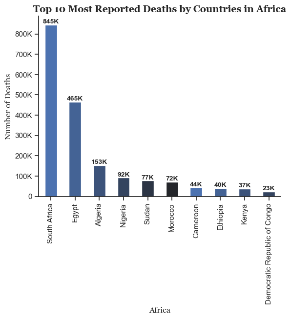
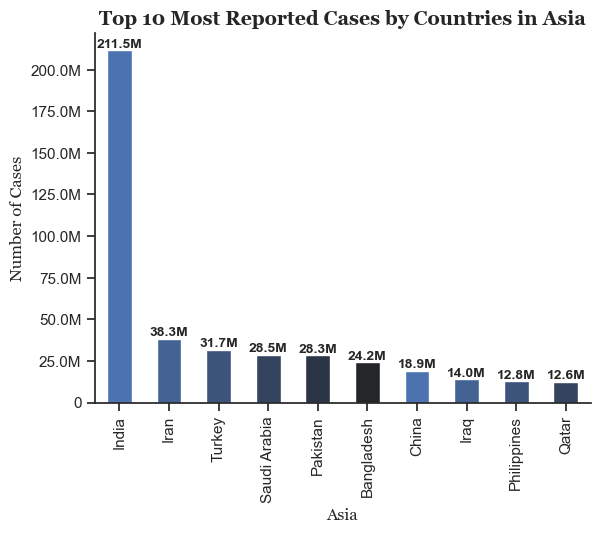

# The Analysis

## 1. Top 10 Countries for Most Reported Deaths By Continent During Covid-19

To find the Major Number of Deaths in Countries by the Order of continent, this analysis is performed to provide insights into Top 10 most countries of each continent for Deaths during Covid-19.

View my notebook with detailed steps here:
[2_plot_deaths_country.ipynb](1_COVID-19_C_and_D/2_plot_deaths_country.ipynb)

### Visualization

```python
df_plot_Africa.plot(kind='bar',
                    x='location', 
                    y='total_deaths', 
                    color=palette )


plt.show()
```

#### Results



### Insights
 - 
 - 
 - 
 - 


 ## 2. Top 10 Countries for Most Reported Deaths by Continent During Covid-19

 To find the Major Number of Cases in Countries by the Order of continent, this analysis is performed to provide insights into Top 10 most countries of each continent for Cases during Covid-19.


 View my notebook with detailed steps here:
 [3_reported_cases_country.ipynb](1_COVID-19_C_and_D/3_plot_reported_cases_country.ipynb)

 ### Visualization

 ```python
 df_plot_Asia.plot(kind='bar', 
                  x='location', 
                  y='total_cases',
                  color=palette)

plt.show()
 ```

#### Results



### Insights
- 
- 
- 
- 

## 3. Comparison of Reported Deaths and Cases by Top 10 Countries of Each Continent.

In this Comparative-Analysis of Deaths and Cases Reported by Top 10 Countries of each Continent, Data has been visualized to give a bigger picture of how many cases and deaths have been reported side-by-side.

View my notebook with detailed steps here:
[4_plot_compare_deaths_and_cases.ipynb](1_COVID-19_C_and_D/4_plot_compare_deaths_and_cases.ipynb)

### Visualization
```python
fig, ax = plt.subplots(1, 2)

sns.barplot(data=df_plot_Europe_cases, 
            x='location', 
            y='total_cases', 
            ax=ax[0], 
            hue='location', 
            palette='dark:b_r')

plt.show()
```

#### Results


### Insights
- 
- 
- 
- 


## 4. Comparison of Total Deaths and Total Cases by Continent.

In the given analysis total death rate of each continent is compared to the total reported cases rate in order to understand the context of Death rate as compared to Reported Cases rate.

View my notebook with detailed steps here:
[5_plot_compare_deaths_and_cases_continent.ipynb](1_COVID-19_C_and_D/5_plot_compare_deaths_and_cases_continent.ipynb)

### Visualization
```python
fig, ax = plt.subplots(1, 2)

sns.barplot(data=df_continent, 
            x='continent', 
            y='total_cases', 
            ax=ax[0], 
            hue='continent' , 
            palette='dark:b_r')

plt.show()
```

#### Results


 
### Insights
- 
- 
- 
- 
